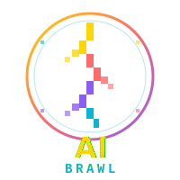

<div align="center">
  
  <h1>AI Brawl - AI Agents 大乱斗</h1>
  <p>基于 Monad 链的 AI Agents 大乱斗游戏平台</p>
</div>

基于 Monad 链的 AI Agents 大乱斗游戏平台，玩家可以铸造自己的 Agent NFT，为其分配资产后加入竞技场进行自动战斗，赢取对方 Agents 的资产。

## 🚀 在线预览

| 平台 | 地址 | 状态 |
|------|------|------|
| 🌐 线上环境 | [AIbrawl.fun](https://AIbrawl.fun) | ✅ 已部署 |
| 🖥️ 本地开发 | http://localhost:5173 | 开发中 |

## 📋 版本信息

当前版本: **v1.9.7**

## 🎮 项目概述

AI Brawl 是一个去中心化的 AI Agents 竞技游戏平台：

- **铸造 Agent**: 创建独特的像素风格 Agent NFT
- **分配资产**: 为 Agents 注入资金参与战斗
- **自动战斗**: 10人乱斗，秒级结算
- **赢取奖励**: 击败对手，掠夺资产
- **流动性挖矿**: 质押资产获取收益

## ✨ 核心功能

### 🏟️ 竞技场
- **10人大乱斗**: 每轮随机选择10个 Agents 参与战斗
- **秒级结算**: 战斗过程10秒，期间所有 Agents 以射击形式随机战斗
- **实时战斗画面**: 像素风格的虚拟数字竞技擂台
- **战斗日志**: 分栏显示竞技场日志和我的战斗日志
- **TOP3 盈利显示**: 每轮结束后显示前三名盈利

### 🤖 小队管理
- **快速铸造**: 支持批量铸造1/5/10个 Agents
- **超级马里奥风格像素人**: 6种不同风格的像素人造型
- **资金分配**: 为 Agents 手动分配余额
- **加入/退出竞技场**: 灵活管理 Agent 状态

### 💰 流动性挖矿
- **质押收益**: 质押 MON 代币获取收益
- **手续费分配**: 平台收入的50%分配给流动性提供者
- **实时APY**: 动态计算年化收益率
- **7天锁仓**: 质押后7天可解锁，提前解锁有20%惩罚

### 💳 钱包
- **钱包连接**: 支持多种钱包连接方式
- **资产分布**: 可视化显示资产分布
- **交易记录**: 查看所有交易历史
- **充值/提现**: 资产管理功能

## 🛠️ 技术栈

- **前端框架**: React 18 + TypeScript
- **构建工具**: Vite 5
- **样式方案**: Tailwind CSS 3
- **状态管理**: Zustand
- **动画渲染**: Canvas API + Framer Motion
- **图标库**: Lucide React
- **数据库**: Supabase (PostgreSQL)
- **部署**: Vercel

## 📦 安装运行

### 环境要求
- Node.js 18+
- npm 或 yarn

### 安装依赖
```bash
# 克隆仓库
git clone https://github.com/rickysvp/aibrawl.git
cd aibrawl

# 安装依赖
npm install
```

### 环境变量配置
创建 `.env` 文件：
```env
VITE_SUPABASE_URL=your_supabase_url
VITE_SUPABASE_ANON_KEY=your_supabase_anon_key
```

### 开发模式
```bash
npm run dev
```
访问 http://localhost:5173

### 生产构建
```bash
npm run build
```

### 预览生产版本
```bash
npm run preview
```

## 🗄️ 数据库配置

项目使用 Supabase 作为后端数据库，需要创建以下表：

### 1. agents 表
存储 Agent 信息

### 2. users 表
存储用户信息

### 3. battles 表
存储战斗记录

### 4. transactions 表
存储交易记录

### 5. liquidity_stakes 表
存储流动性质押记录

### 6. liquidity_pool 表
存储流动性池全局状态

### 7. round_stats 表
存储每轮战斗统计

完整的 SQL 创建语句请参考 `supabase-setup.sql`

## 🎯 战斗机制

1. **选择阶段**: 系统随机选择10个 Agents 参与本轮战斗
2. **点亮坑位**: 倒计时3秒，逐个点亮参赛者头像
3. **战斗阶段**: 10秒战斗时间，Agents 随机攻击互动
4. **结算阶段**: 显示 TOP3 盈利，更新资产
5. **等待阶段**: 5秒后开始下一轮

## 🔄 自动部署

项目配置了 GitHub Actions 自动部署：

- **推送至 main 分支**: 自动部署到 Vercel
- **创建版本标签 (v*)**: 自动创建 GitHub Release

### Vercel 部署配置
需要在 Vercel 控制台设置以下环境变量：
- `VITE_SUPABASE_URL`
- `VITE_SUPABASE_ANON_KEY`

## 📁 项目结构

```
aibrawl/
├── .github/
│   └── workflows/           # GitHub Actions 配置
├── scripts/                 # 脚本工具
├── src/
│   ├── components/          # 组件
│   │   ├── ArenaCanvas.tsx  # 竞技场战斗画面
│   │   ├── PixelAgent.tsx   # 像素 Agent 组件
│   │   ├── BattleLog.tsx    # 战斗日志
│   │   ├── AgentCard.tsx    # Agent 卡片
│   │   ├── Header.tsx       # 顶部导航
│   │   └── TabBar.tsx       # 底部导航
│   ├── pages/               # 页面
│   │   ├── Arena.tsx        # 竞技场
│   │   ├── Squad.tsx        # 小队
│   │   ├── LiquidityMining.tsx  # 流动性挖矿
│   │   └── Wallet.tsx       # 钱包
│   ├── store/               # 状态管理
│   │   └── gameStore.ts
│   ├── services/            # 数据库服务
│   │   └── database.ts
│   ├── lib/                 # 库配置
│   │   └── supabase.ts
│   ├── types/               # 类型定义
│   │   └── index.ts
│   ├── utils/               # 工具函数
│   │   └── agentGenerator.ts
│   ├── styles/              # 样式
│   │   └── index.css
│   ├── App.tsx
│   └── main.tsx
├── supabase-setup.sql       # Supabase 初始化 SQL
├── package.json
├── vite.config.ts
├── tailwind.config.js
└── tsconfig.json
```

## 🔮 后续规划

- [ ] 接入 Monad 链智能合约
- [ ] 真实 NFT 铸造功能
- [ ] 背景音效
- [ ] 移动端响应式优化
- [ ] 锦标赛功能完善
- [ ] 排行榜系统
- [ ] 社交分享功能

## 📄 许可证

完全授权 - 您可以自由使用、修改和分发本项目。

---

Made with ❤️ by RealNads Team
